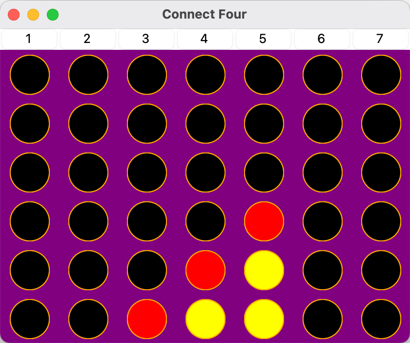
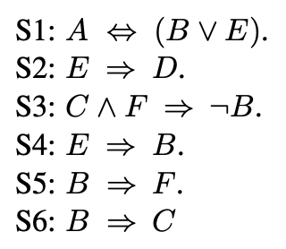
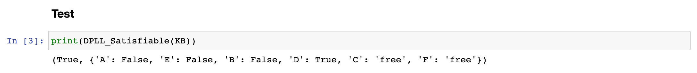
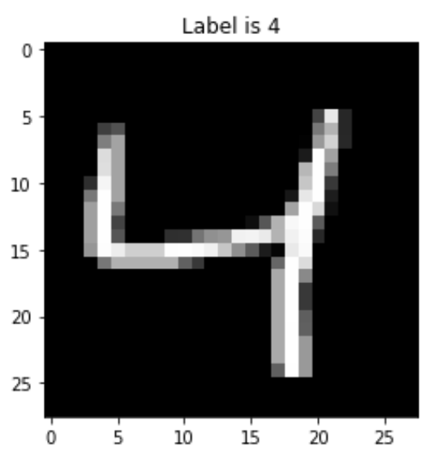
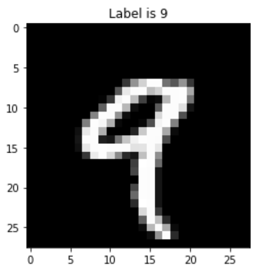
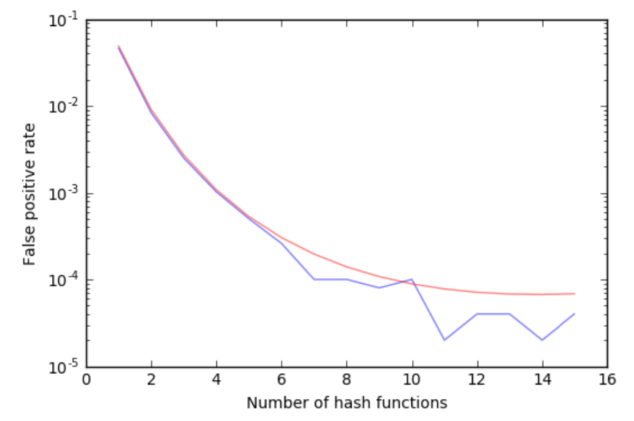

# Ricardo Montalvo's Portfolio

## [Project 1: Connect Four with AI adversary](https://github.com/ricardomontalvo/Connect-4-with-AI-adversary)
- Implementation of the classic Connect Four game where a user can play against an AI adversary
- The AI uses the MTD(f) algorithm in order to compute one of the best moves available

## [Project 2: DPLL algorithm implementation from scratch](https://github.com/ricardomontalvo/DPLL-algorithm)
- Davis–Putnam–Logemann–Loveland algorithm implemented from scratch
- It takes logical formulas in the conjunctive normal form and outputs whether they are satisfiable and, if so, a model that works

Example of use:

Knowledge base:

Output:

## [Project 3: Classification of the MNIST dataset using SVMs](https://github.com/ricardomontalvo/MNIST-dataset-with-SVMs)
- This is a report of a time when I used SVMs to classify two digit classes (4 and 9) from the MNIST dataset
- First, the datasets are downscaled using LDA
- Then, I apply SVMs with the following kernels: linear, poly and rbf
- Error rates and training times are reported

Item from the 4 class:

Item from the 9 class:

## [Project 4: Longest common subsequence (LCS) implementation](https://github.com/ricardomontalvo/Longest-common-subsequence-algorithm)
- Algorithm that finds the longest common subsequence given two strings as inputs as well as the lenght of said LCS

## [Project 5: Bloom Filter implementation](https://github.com/ricardomontalvo/Bloom-filter-report)
- Implementation of a Bloom Filter using the mmh3 hash function
- The false positive ratio is given by using various numbers of hash functions are compared to the theoretical predictions

